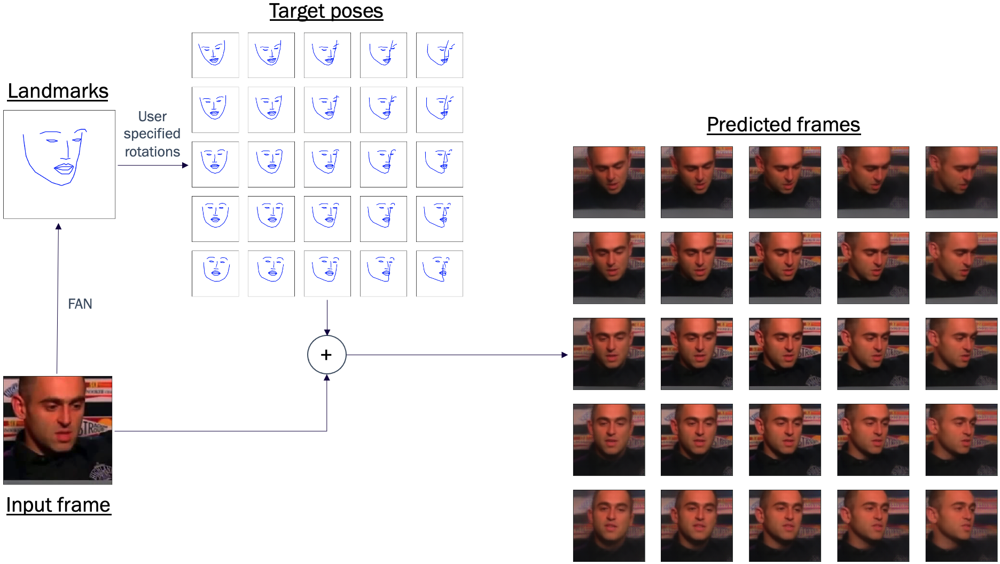
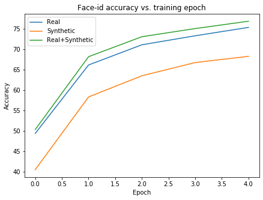
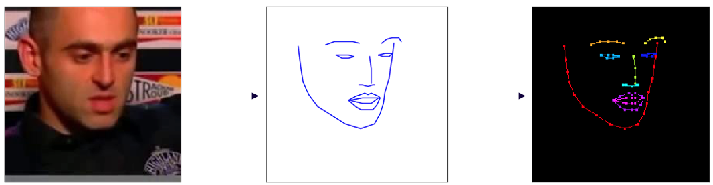

# 3-D Data Augmentation

## Abstract
Although deep learning has made significant advancements in the last decade, data augmentation has remained
stagnant. The techniques used for data augmentation a decade ago continue to be the most prominent techniques
used today. We present a procedure to train and leverage deep generative modeling to add a novel class of
transformations to traditional data augmentation strategies. In this work we generate a unique set of
augmentation transforms by leveraging a neural network's ability to both learn a dataset's distribution and its
capacity to encode complex three dimensional spatial transformations. Our implementation involves training a 
neural network to produce novel perspectives or poses of an object of interest from a single input image and then 
utilize this generator to train a robust classifier. To demonstrate its feasibility, we apply our technique on a 
specific use case: person identification via facial imagery. Our method is shown to generate data distributions 
consistent with the novel real-world data and we demonstrate that the generated images can be successfully 
leveraged to train the models to higher performance.  We demonstrate that using a single, fixed synthetic image 
to augment an existing dataset during training leads to a 2-3\% improvement to model accuracy on real data.


## System design
As mentioned, the goal of the system is to generate new perspectives of an input face given a set of target poses to be then used in training.  The overall inference pipeline is shown in the following figure:



Given an input face, we first extract the face landmarks using [FAN](https://github.com/1adrianb/face-alignment), and then provide a set of target poses by rotating the images.  The target poses are fed with the original input and used to generate the novel perspectives.


  The ultimate goal of our approach was to leverage these novel, synthetic perspectives to augment a dataset during training. To test the feasability we trained three models on the task of identifying the people in the videos using their faces:  
  - Real: Trained using a single, real image from each video.
  - Synthetic: Using a single, synthetic analogue image from each video.
  - Real+Synthetic: Trained using a real and synthetic image from each video, illustrating our data augmentation technique.
  
The performance of these model, against a real validation dataset, is shown in the following figure, indicating that: a)synthetic images can be used to train models, albeit with some performance loss and b) including our synthetic images to augment data in training can improve a models accuracy.




## Requirements
To train, build and run the generator on a given image/landmark pair you will need: 

- numpy==1.18.1
- torchvision==0.5.0
- tqdm==4.44.1
- matplotlib==3.1.3
- pandas==1.0.3
- torch==1.4.0
- Pillow==7.2.0

### Face Alignment Network
In order to preprocess the VoxCeleb dataset it is necessary to download the latest version of the landmark extractor face-alignment network [FAN](https://github.com/1adrianb/face-alignment).  To install the 
```
git clone git@github.com:1adrianb/face-alignment.git
cd face-alignment
python setup.py install
python -m pip install
```

### VoxCeleb2
To reproduce our results you should gain access to the [VoxCeleb2](https://www.robots.ox.ac.uk/~vgg/data/voxceleb/vox2.html) dataset and follow the instructions to download the video files.  Follow this [link](https://docs.google.com/forms/d/e/1FAIpQLSdQhpq2Be2CktaPhuadUMU7ZDJoQuRlFlzNO45xO-drWQ0AXA/viewform?fbzx=7440236747203254000) to request access to the dataset.

## Preprocessing
We have included a script, and relevant metadata, to preprocess the data.  Five frames are selected from each video and the face landmarks extracted from each.  the five, face/pose pairs (illsutrated in the following figure) are saved to the target directory for training.


Before starting the preprocessing, you should edit the file [./p2p/config.py] to reflect your own local directory structure.  or the preprocessing you should set:
- args['root_dir']: The global path to your working directory.
- args['video_dir']: The relative (to root_dir) path to the raw, VoxCeleb video files.
- args['data_dir']: Relative path to the output directory for the rpeprocessed files.
- args['meta_data']: Relative path to the metadata.

Once the config has been set up, you can preprocess the files by running:
```
python preprocess.py
```

## Training
Once the data has been been successfully preprocessed you can start to train the pose-2-pose model. Again, edit the config file to reflect your local directory structure and data locations, as well as the hyperparameter selections.  We have included scripts for both a regular training procedure and a GAN based approach.  Once the configuration has been set you can run:
```
python train.py
```
or
```
python GAN_train.py
```

## Inference and tests
In [notebooks](./notebooks) we have included two noteboooks to illustrate the inference pipeline and a simple study comparing the inter(real vs real) and intra(real vs syntehtic) data distributions.

## Paper
The details of our approach are included in a journal article that is currently under double-blind review.  This section will be updated with a link to the documentation once the review process is completed.
